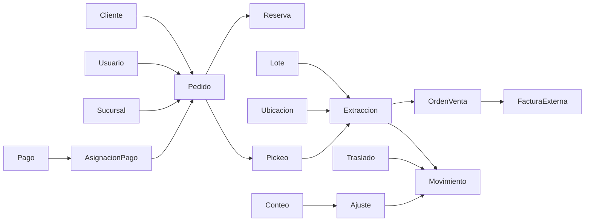

# Especificación funcional I0

Versión 0.1 - 28 de agosto de 2026. Reglas C = confirmadas; P = propuesta de diseño. D1-D11 remiten a decisiones-y-revision.md. El comportamiento técnico detallado sigue siendo diseño, no implementación.

## 1. Objetivo y límites

Conectar catálogo, venta presencial y pedidos web con inventario trazable por lote y ubicación, pagos manuales verificados, preparación y documento para facturación externa.

Central abastece sucursales. La sucursal tiene bodega y sala separadas. Web usa solo la bodega de la sucursal seleccionada; venta presencial registra salida desde su ubicación real.

Sin facturación fiscal interna, pasarela, contabilidad integral, crédito ni integración externa automática aprobada. Parking lot: fidelización, recomendaciones, operaciones PWA sin conexión y detalles visuales finales. UX operativo y adaptación a dispositivos pertenecen a cada incremento.

## 2. Glosario operativo

| Término | Definición |
|---|---|
| Producto/variante | Identidad vendible con características concretas; variantes distintas no suman para mayoreo |
| Presentación | Unidad o fardo, con equivalencia vigente y precio propio |
| Unidad base | Unidad física en que se mantienen y concilian cantidades |
| Caja/bulto | Contenedor identificado y contenido trazable; no stock adicional |
| Lote | Origen de ingreso con antigüedad y costo histórico; sobrevive a traslado y reempaque |
| Ubicación | Lugar físico dentro de central/sucursal: sala, bodega, preparación, etc. |
| Carretilla | Intención de compra sin reserva ni derecho preferente |
| Pedido | Solicitud aceptada, con cliente, canal, sucursal y cantidades comerciales |
| Reserva | Unidades temporalmente apartadas al aceptar pedido web |
| Compromiso confirmado | Unidades asignadas tras verificar el pago, antes de salida física |
| Pickeo | Instrucción y registro de extracción por lote/ubicación |
| Reempaque | Formación de un paquete conservando el origen de sus componentes |
| Orden de venta | Resultado comercial de preparación, enlazado al pedido y extracciones |
| Prefactura | Nombre propuesto para impresión de la orden destinada a facturación externa |
| Despacho | Salida física de mercancía, no mera coordinación o impresión |
| Entrega | Confirmación de recepción por el destinatario; no otra salida de inventario |
| Traslado | Movimiento interno o entre bodegas; los interbodega tienen tránsito/recepción |
| Disponible | Físico apto aún no reservado ni comprometido |
| Devolución física | Recepción real de mercancía; distinta de devolución de dinero |
| Ajuste | Movimiento autorizado para resolver diferencia, no sobrescritura sin historial |

## 3. Reglas identificadas

| ID | Estado | Regla verificable | Incremento |
|---|---|---|---|
| RN01 | C | Invitado puede enviar con datos y contacto verificable; cuenta opcional | I5 |
| RN02 | C | Cliente elige sucursal; existe valor por defecto | I5 |
| RN03 | C | Web no reserva sala, central ni tránsito; requiere traslado previo a bodega | I3/I5 |
| RN04 | C | Unidad y fardo tienen precios normal y mayorista propios; mínimo 3 de su presentación/variante | I2 |
| RN05 | P | Líneas repetidas de la misma presentación se agrupan; presentaciones mixtas no suman mínimos sin D1 | I2 |
| RN06 | C | Carretilla no reserva; aceptar pedido web reserva por una hora | I5 |
| RN07 | C | Reporte de pago con reserva vigente la mantiene en revisión sin liberación por la hora original | I5/I6 |
| RN08 | C | Pago verificado completo permite preparación; puede provenir de varias transferencias o efectivo en sucursal | I6 |
| RN09 | C | Vencido exige pedido nuevo; copiar no recupera reserva antigua | I5 |
| RN10 | C | Liberación manual por personal autorizado y revisión con responsable/antigüedad/alertas | I6 |
| RN11 | C | Cambios de cantidad/sucursal/entrega requieren revisión explícita de existencias, precio y pago | I6 |
| RN12 | C | FIFO/PEPS físico; reempaque del mismo producto y características conserva orígenes | I2/I6 |
| RN13 | C | Salida web al despachar lo preparado; entregado y factura no descuentan de nuevo | I6 |
| RN14 | C | Venta presencial descarga en Los Cheles; factura se emite externamente | I4 |
| RN15 | C | Faltantes después del pago requieren contacto y autorización de parcial; devolución por lo no suministrado | I6 |
| RN16 | C | Encargado/supervisor recibe devoluciones; daños ingresan y después se descargan | I4 |
| RN17 | P | Mercancía devuelta entra bloqueada hasta revisión; devolución de dinero sin mercancía no crea stock | I4 |
| RN18 | C | Traslado identifica cajas/contenido, salida con fecha/hora y recepción conciliada | I3 |
| RN19 | P | Registrar recepción real y mantener diferencia pendiente; no forzar igualdad | I3 |
| RN20 | C | Conteos periódicos en bodegas/salas; ajustes solo superiores | I4 |
| RN21 | C | Carga inicial con origen/fecha y trazabilidad; costos de ingresos distintos separados | I2 |
| RN22 | C | Vendedor sin costos; bodega sin precios ni costos, incluidas salidas documentales | I1 |
| RN23 | C | Permisos parametrizables por rol y usuario; precios, ajustes, reembolsos y administración restringidos | I1 |
| RN24 | C | Factura externa relacionada con orden de venta, no duplicación de venta | I4 |
| RN25 | C | Tarifas de envío por distancia administradas por mandos medios/superiores, no vendedores | I5 |
| RN26 | C | Retiro y domicilio; confirmar entregado además de despachado | I6 |
| RN27 | P | Guardar precios/equivalencias/envío al aceptar pedido; vigencias nuevas no reescriben histórico (D2) | I2/I5 |
| RN28 | C | Dinero tardío/reembolsos resueltos por superiores; pedido vencido no se reactiva | I6 |

Los mínimos actuales sustituyen “más de tres” anterior. Un fardo de diez es diez unidades físicas, pero una sola presentación para precio de fardo. Importes y D1 todavía deben aprobarse.

## 4. Estados separados y transiciones

Nombres internos propuestos. El cliente ve estados sencillos; no usar un único campo para deducir pago, factura y entrega.

### Pedido comercial

| Desde | Evento/condición | Hacia | Efecto |
|---|---|---|---|
| Borrador | Contacto/total/disponibilidad válidos; aceptación y reserva atómicas | Aceptado | RN06; no salida física |
| Aceptado | Expira reserva sin reporte | Vencido | Libera pendiente; conserva historial |
| Aceptado | Solicitud de cambio | Cambio en revisión | Mantener estado efectivo anterior hasta aprobar; D7 |
| Aceptado/cambio | Aprobación y validación conjunta | Aceptado, nueva versión | Ajustar reserva/importes coherentemente |
| Aceptado | Cancelación autorizada | Cancelado | Resolver reserva, pago y físico según fase |
| Aceptado | Cumplimiento y conciliación | Completado | Cierre propuesto; no sustituye estados financieros |

Vencido/cancelado no vuelven a aceptado al copiar: se crea ID nuevo con referencia al origen. Una incidencia no borra lo ya ocurrido.

### Reserva y pago

| Reserva | Evento | Resultado |
|---|---|---|
| Activa, con vencimiento | Reporte vigente | En revisión, sigue apartada |
| Activa | Vence sin reporte | Expirada; se libera una vez |
| En revisión | Verificación de total | Confirmada; pasa a compromiso sin otro descuento disponible |
| Activa/en revisión | Liberación manual autorizada | Liberada; no reembolso implícito |
| Confirmada | Despacho | Consumida por salida física |

Pago: pendiente → reportado/en revisión → verificado; rechazo deja evidencia y resolución manual, no liberación automática inferida. Cada transferencia tiene evidencia, estado, importe y asignación. El pedido solo queda pagado cuando la suma verificada asignada cubre el total autorizado. Diferencias/sobrepago se concilian, no se absorben silenciosamente. Un comprobante no puede financiar dos pedidos con el mismo importe.

Reporte, vencimiento y liberación compiten bajo la misma validación de estado/versión; prevalece lo confirmado en servidor. Si el reporte llega cuando ya expiró, se trata como incidencia tardía (D8). Umbral horario exacto y desfases de red se explican al cliente; reloj del navegador no decide.

### Preparación y entrega

Pendiente de pago → lista para preparar (pago completo) → en preparación → preparada → despachada → entregada.

Incidencia de faltante detiene cierre hasta respuesta y resolución de importes. El parcial autorizado conserva solicitado, preparado y pendiente/cancelado por separado. No entregar “como completo” por cambiar la cantidad original.

Confirmar extracción mueve al área de preparación, preservando lote; no es la salida de venta. Despachar reduce físico y compromiso una sola vez. Coordinar transporte sin entregar mercancía al transportista no provoca una salida ficticia. En retiro, despacho y entrega pueden confirmarse juntos, con eventos diferenciados.

### Traslado

Borrador → autorizado → preparado → en tránsito → recibido parcial / recibido completo → cerrado.

La autorización y cierre son propuesta de flujo por validar, no todos los roles pueden ejecutarlos. Despacho reduce físico de origen y crea tránsito; recepción mueve solo lo recibido a destino. Diferencias siguen en tránsito pendiente o resolución documentada; no desaparecen al cerrar. Recibido dañado entra bloqueado. Cancelar después de despacho requiere corrección/retorno, no borrar el traslado.

### Conteo y devolución

Conteo: programado → contando → diferencias en revisión → ajuste autorizado → cerrado. D5 define cómo evitar movimientos incompatibles. Ajuste no altera conteo original.

Devolución física: solicitada → recibida en revisión → apta o dañada → habilitada o baja. Reembolso: solicitado → autorizado → registrado/conciliado; corrección externa mantiene referencia/estado propio. Ninguno de esos tres estados prueba automáticamente los otros.

## 5. Invariantes de inventario y dinero

Diseño propuesto con categorías excluyentes:

- F = físico en ubicación/sede (incluye preparación).
- R = reservado temporal, incluidas reservas en revisión.
- C = comprometido tras pago y para traslados autorizados.
- B = bloqueado/no vendible, sin contarlo simultáneamente en R/C.
- Disponible = F - R - C - B. Tránsito fuera de F de origen/destino hasta recepción.
- Un producto reservado que se descubre dañado exige resolución transaccional: no agregarlo a B conservando un compromiso no respaldado.
- Reservar: R aumenta, F no cambia. Verificar: R disminuye y C aumenta igual. Despachar: F y C disminuyen igual. Liberar R devuelve disponible, no incrementa F.
- Movimiento sala → bodega conserva total sede; reempaque conserva unidades y genealogía; lote no se rejuvenece.
- Todas las cantidades de inventario se calculan en unidades base, positivas y con equivalencia registrada. No usar stock de bultos además del contenido.
- Importes/costos con decimal exacto, no punto flotante; escala/moneda y redondeo deben definirse en implementación. Costos por unidad pueden necesitar más precisión que el total cobrado.
- Reintentar un comando conserva un identificador de operación y no duplica movimientos/pagos; cambio y auditoría se confirman juntos.

Ejemplo de escritorio: F=100, R=C=B=0. Reservar 30: disponible 70. Reportar mantiene 70. Verificar: R=0, C=30, disponible 70. Extraer a preparación no altera F de sede. Despachar: F=70,C=0, disponible 70. Confirmar entrega no cambia cantidades.

## 6. Matriz inicial de permisos

Alcance siempre por sucursal/datos autorizados. “Sí” representa responsabilidad confirmada, no permiso implementado. “P” = asignación propuesta pendiente; “No” = denegación por defecto. Supervisor representa superior autorizado; no equivale a acceso automático a todos los costos.

| Acción | Cliente/invitado | Vendedor | Bodega | Superior | Administrador de acceso |
|---|---|---|---|---|---|
| Pedido propio/seguimiento | Sí, acceso privado | Según alcance | Solo operativo P | Según alcance | No implícito |
| Crear venta/pedido | Propio | Sí | No | P | No implícito |
| Ver precio de venta | Sí | Sí | No | Según permiso | No implícito |
| Ver costo/margen | No | No | No | Solo financiero autorizado | No implícito |
| Verificar pago ordinario | No | Sí con permiso | No | Sí | No implícito |
| Liberar reserva pendiente | No | Sí con permiso | No | P | No implícito |
| Pickeo/traslado físico | No | P | P | P | No implícito |
| Confirmar traslado | No | No por defecto | No por defecto | Sí encargado | No implícito |
| Capturar conteo | No | P | P | P | No implícito |
| Aprobar ajuste/baja | No | No | No | Sí | No implícito |
| Resolver reembolso/dinero tardío | No | No | No | Sí | No implícito |
| Cambiar precios | No | No | No | Sí con permiso | No implícito |
| Editar/asignar tarifa manual | No | No | No | Sí, incluye mando medio autorizado | No implícito |
| Conceder/revocar permisos | No | No | No | Solo administrador delegado | Sí |

Mandos medios acceden a tarifas, no automáticamente a facultades de superiores. D6 propone denegación explícita sobre concesión, excepciones individuales visibles, prohibición de autoescalamiento y delegación limitada. Revocación debe invalidar permisos efectivos/sesiones según política; ocultar botones no es autorización. Un rol técnico de acceso no recibe datos financieros por defecto.

Auditoría propuesta: actor, sucursal, acción, entidad, motivo, versión previa/nueva, fecha de servidor e ID de operación; evitar credenciales, tokens y contenido completo de comprobantes en logs.

## 7. Modelo conceptual propuesto

No es esquema SQL aprobado. Separa identidad del cliente de cuenta/actor, inventario de presentación y documentos de eventos físicos.

| Agregado | Entidades y relación | Datos/controles principales |
|---|---|---|
| Identidad | Cliente → 0..1 cuenta; usuario → roles/permisos/sucursales | Invitado conserva cliente; actor vendedor distinto del comprador; acceso privado |
| Catálogo | Producto → variantes → presentaciones → versiones de precio | SKU único, equivalencia, mínimo y precio por presentación |
| Almacén | Sede → ubicaciones; lote → saldos por ubicación/condición | Origen/fecha/costo separado; central no vende web |
| Contenedores | Bulto → componentes de lote/variante | Código estable; composición y genealogía, sin saldo duplicado |
| Existencias | Operación → movimientos → líneas de origen/destino | Cantidad base, lote, ubicación, motivo, unicidad de operación |
| Pedido | Cabecera → versiones → líneas | Cliente, actor, canal, sucursal, copia de precios/equivalencias y entrega |
| Reserva | Pedido → reserva → asignaciones de existencias | Estado, vencimiento, versión; momento de asignar lote específico pendiente técnico de I2 |
| Pagos | Movimiento de pago → asignaciones → pedido | Verificación, total aplicado, referencia/evidencia restringida, dinero tardío |
| Preparación | Pedido → hoja → extracciones → reempaque/componentes | Solicitado vs real, lote/ubicación/cantidad, responsable, autorización parcial |
| Documentos | Pedido → orden de venta → referencia factura externa | No doble movimiento; cardinalidad factura/orden D9 |
| Traslado | Cabecera → líneas/bultos → despachos/recepciones | Tránsito, cantidades reales, incidencias y resolución |
| Control | Conteo → líneas/recuentos → ajuste autorizado | Corte/movimientos según D5; no sobrescritura |
| Devolución | Venta → devolución física; venta → reembolso | Lote identificable, condición, corrección externa independiente |
| Envíos | Tarifa versionada → cotización → pedido → entrega | Distancia/cobertura, sucursal, aceptación, evidencia, D4 |
| Importación | Carga → filas → operaciones iniciales | Huella, origen, resultado, usuario; costos con permiso |

Relaciones principales:

El diagrama es conceptual, no prescribe una relación uno a uno. Conservar claves foráneas, versiones e historial; no borrar documentos comerciales para corregirlos. Reembolso y retorno se consultan desde orden/pedido sin modificar evidencia original.

## 8. Contratos de operación propuestos

| Operación | Comprobaciones atómicas | Resultado persistido |
|---|---|---|
| Aceptar pedido | Contacto válido, sucursal, total autorizado, saldo vendible, versión | Pedido + líneas + reserva + vencimiento + auditoría |
| Reportar pago | Acceso al pedido, reserva aún válida o ruta de incidencia | Evidencia privada + revisión; no pago aprobado |
| Verificar total | Permiso, evidencias, asignación no duplicada, reserva vigente/en revisión | Pago completo + compromiso; no salida |
| Cambiar pedido | Permiso/D7, versión, precio/pago/saldo, respuesta cliente | Versión nueva o ninguna modificación |
| Despachar | Preparación autorizada, cantidades reales, pago/ajustes resueltos | Movimiento de salida + estado + auditoría una vez |
| Recibir traslado | Permiso, cantidades no recibidas previamente, condición | Físico destino + tránsito restante + incidencia |
| Ajustar conteo | Permiso superior, recuento y motivo, corte consistente | Movimiento compensatorio, no edición del pasado |

Archivos de comprobante deben validarse y almacenarse fuera de exposición pública; límites, tipos permitidos y accesos se especifican al implementar. No activar mapas/mensajería sin proveedor y autorización.
